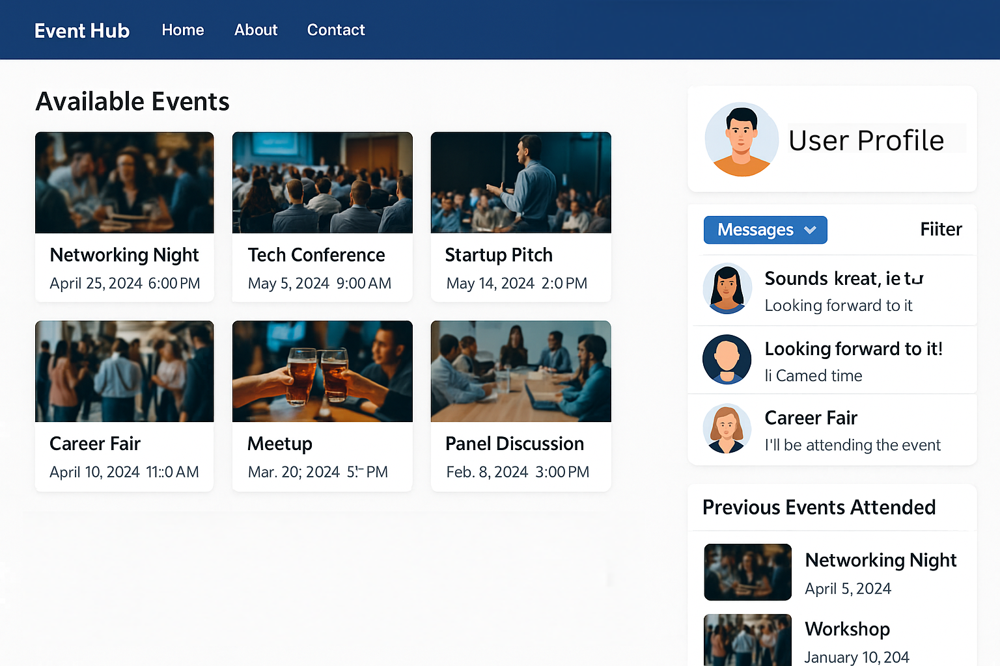

# Event Registration Web Application MVP Documentation (Visitors)

## Global Inbox & Connections

The **Global Inbox & Connections** feature allows users to access and manage all their cross-event communications and networking relationships in a centralized view. This page is available **before selecting a specific event**, making it easy for users to continue conversations or build connections across multiple fairs or conferences.

### Key Components

---

### 1. Global Messages Panel

This section displays all direct message threads from **any event the user has attended**. Each thread is marked with a clear event identifier.

#### Message Thread Elements:

| Field             | Description                                                                 |
|------------------|-----------------------------------------------------------------------------|
| **Event Tag**     | Could be a small **event logo**, **badge**, or **event name** (e.g., "Empower Live") to distinguish origin |
| **Profile Avatar**| Photo or initials of the other participant                                 |
| **Name & Role**   | Full name and optional job title                                            |
| **Preview Text**  | A snippet of the most recent message                                        |
| **Timestamp**     | Time of last interaction                                                    |

> *Planned Behavior*:  
> - Clicking a thread takes user to a dedicated chat view with **event context**.  
> - Archived and unread filters can be applied across all events.

---

### 2. Global Connections List

This panel shows every connection the user has made **across events** — attendees, speakers, and exhibitors.

#### Connection Card Fields:

| Field                   | Description                                                       |
|------------------------|-------------------------------------------------------------------|
| **Profile Picture / Initials** | User's image or fallback badge                      |
| **Full Name**          | Connected individual’s name                                       |
| **Position/Company**   | Optional subtitle                                                 |
| **Event Tag**          | A visual tag representing the source event (logo or title)        |
| **Interaction Date**   | Date of connection or last message                                |

> *MVP Logic*:  
> - Users can **filter** by event, connection type (exhibitor, attendee, speaker), or name.  
> - Clicking a connection opens the detailed profile

---

### 3. Filters & Search

A global search and filter bar allows narrowing the list of messages or connections:

| Feature            | Description                                                          |
|--------------------|----------------------------------------------------------------------|
| **Search Bar**     | Allows searching by name, role, company, or event                    |
| **Event Filter**   | Dropdown or chip-selector for selecting one or more events           |
| **Sort Options**   | Sort by most recent, alphabetical, or by event                       |

---

## Event Dashboard

 

The **Dashboard** is the central hub of the user’s experience. It provides an at-a-glance summary of the most important metrics, upcoming activities, recommendations, and personal data for an event or fair. This is the first screen the user sees after logging in and is tailored to their engagement with the platform.

---

### Key Components

---

### 1. Top Metrics Cards

Displays summary tiles with numerical stats:

- **Exhibitors**: Number of exhibitors of the event that the user interacted with. If you click on this card, you will be sent to "Exhibitors" tab of the site.
- **My Badge**: Quick access to the user's digital badge.

- **Products**: Number of products viewed, saved, or interacted with. If you click on this card, you will be sent to "Products" tab of the site.

---

### 2. Recommended Exhibitors

A horizontal scrollable carousel showing exhibitors personalized to the user based on preferences or browsing behavior.

**Displayed Info:**
- Logo of each exhibitor.
- Inline scroll bar for navigation.

> *Features to include*:
> - Clicking an exhibitor opens their profile page.

---

### 3. My Calendar

Panel showing upcoming personal activities (e.g., meetings, sessions booked).

- Text: `"No upcoming personal activities"` if empty.
- **View all**: Link to open the full calendar.

---

### 4. What’s On

Section showing real-time or scheduled events during the fair.

- Lists currently happening or soon-to-start sessions.
- **View all** link navigates to a full event schedule.

> 🔧 *MVP Behavior*:
> - If no sessions are happening, display `"No upcoming activities"`.
> - Highlight live sessions differently.

---

### 5. Sponsors

A visually distinct (yellow background here) section highlighting top sponsors of the event.

- Logos of sponsor companies.
- Typically clickable to sponsor profile.

---

### 6. Recommended Products

Another horizontal scrollable panel displaying suggested products from various exhibitors.

**Displayed Info:**
- Thumbnail of product
- Product name (truncated if too long)

> *Functionality*:
> - Clicking opens product detail view.
> - AI-based recommendation model (future enhancement).

---

### 7. Messages

Section for showing number of new messages you have. If you have no new message, it will show **0 messages**. Clicking this card will send you to **Messages** section of the website.

---

### 8. Connections

Section for showing number of connections you have made in this event. If you have no connections, it will show **0 connections**. This number will be incremented with each connection you make.Clicking this card will send you to **Connections** section of the website.

--

## Website Header

The **Header** is a persistent, top-level navigation bar that provides access to user account settings and timezone preferences. It ensures that users can customize their experience, change language, and manage their identity from anywhere in the application.

---

### Key Components

---

### 1. Timezone Selector

this dropdown allows users to switch between:

- **Browser timezone**: Based on the user’s local machine time.
- **Event timezone**: Based on the timezone defined for the event/fair.

---

### 2. User Profile Menu

Located on the top-right, this section includes:
- **Initials Badge** (e.g., `HD`) – auto-generated from user name.
- **User Greeting** – "Welcome back, [User Full Name]".-

#### Dropdown Options:

| Option                | Description                                                      |
|-----------------------|------------------------------------------------------------------|
| Upload profile photo | Allows the user to upload or change their profile image          |
| Public profile settings | Redirects to user profile page where personal/public info can be updated |
| Change Language      | Opens a language selector modal or dropdown                     |
| Log out              | Logs the user out of the session securely                       |

---

## Sidebar Navigation

The **Sidebar** provides a structured and intuitive way for users to navigate the event platform. It separates event-related features from personal tools and includes key branding and contextual information like event name and date.

---

### Key Components

---

### 1. Event Branding

At the top of the sidebar:
- **Event Logo/Image**
- **Event Title** — Example: `EMPOWER LIVE`
- **Event Date Range** — "From Sep 24, 2025" to "Sep 30, 2025"

> *Purpose*: Sets context and branding for the user throughout the platform.

---

### 2. Navigation Sections

#### A. Main Navigation

Under the label `EVENT`, the following primary sections are included:

| Title              | Route / Behavior                    |
|--------------------|-------------------------------------|
| **Dashboard**       | Takes user to dashboard overview    |
| **What's On**       | View sessions and agenda            |
| **Event Information**| Event description, venue, contacts |
| **Exhibitors**      | List of all exhibitor profiles      |
| **Products**        | Marketplace or product listing      |
| **Attendees**       | Browse or search attendees          |

---

#### B. Personal Tools

Under the label `PERSONAL`:

| Title         | Route / Behavior                      |
|---------------|----------------------------------------|
| **My Calendar** | User’s personal session schedule       |
| **Messages**    | Access to direct messages or chat     |

---

## What's On

The **"What's On"** section provides attendees with a clear, organized, and interactive view of the event’s schedule. It allows filtering sessions by track, location, or as a complete list. This section helps users plan their attendance, discover sessions, and manage their time effectively.

---

### Key Features

---

### 1. By Track View

When **By track** is active, the page shows:

- Horizontal track categories (e.g., Business, Science & Technology, Food & Drink)
- Time-slotted agenda displayed vertically
- Each session aligned under its respective track

#### Session Card Details:

| Element                | Description                                                  |
|------------------------|--------------------------------------------------------------|
| **Session Title**       | Full name of the session                                     |
| **Time**                | Start and end time (e.g., 12:30–13:00)                       |
| **Labels**              | - Paid / Free (open access)   - LIVE badge (if real-time) |
| **Color Coding**        | Distinct pastel color per track or session type             |

---

### 2. By Location View

This view organizes sessions by **venue or room** instead of content track. It is designed to assist in **spatial navigation** for physical or hybrid events.

#### Example Columns:
- **Main Hall**
- **Room 1**
- **Room 2**
- **Auditorium**

#### Key Features:
- Horizontally scrollable venue headers
- Each column shows the sessions taking place in that room
- Session cards are placed in vertical time alignment
- Breaks (e.g., "Refreshment Break") stretch across all columns when applicable

---

### 3. List View

This is a **chronological flat list** of all sessions, regardless of track or location. Ideal for users who prefer scanning all content in one vertical stream.

### Structure:
- Grouped by **date** (e.g., "June 26, 2025")
- Each session displayed as a minimal, card-like row

---

### 4. Filters (Optional MVP)

- Filter icon (top-right corner) to allow for example:
  - Track selection
  - Speaker filter
  - Session type (Free / Paid / Live)

---

## Event Information

The **Event Information** section acts as a centralized hub for practical details that help attendees navigate, prepare for, and maximize their event experience. It includes categorized cards such as transportation, accommodation, dining, planning tips, and more.

---

### Key Components

---

### 1. Top Tab Navigation

The section includes three tabs for content filtering:

| Tab                | Description                                                     |
|--------------------|-----------------------------------------------------------------|
| **All**            | Shows all available information cards                           |
| **Recently Viewed**| Displays only those cards the user has recently interacted with |
| **Favorites**      | Contains cards the user has marked with a ⭐️                    |

---

### 2. Information Cards

Each item is shown as a **clickable information card** with:

| Field              | Description                                                   |
|--------------------|---------------------------------------------------------------|
| **Icon**           | Visual representation (e.g., plate icon for food)             |
| **Title**          | Name of the category (e.g., "Food & Drink")                   |
| **Subtitle**       | Brief explanation (e.g., "Where to eat")                      |
| **Star icon**      | Allows the user to favorite an info card                      |
| **Arrow icon**     | Indicates it leads to more detailed content                   |

### Example Cards:
- **Food & Drink** – Where to eat
- **Getting Here** – Transport options & guidance
- **Plan Your Day** – Tools for scheduling and tips
- **Where to Stay** – Hotel information and deals

---

### 3. Search & Filter (Top Right)

- **Search box** to allow keyword-based filtering of cards (e.g., typing "food" filters to "Food & Drink").
- **Filter icon** placeholder to support additional filters like tags or categories.

---

## Exhibitors

The **Exhibitors** section showcases all participating companies at the event. Users can browse, search, favorite, and connect with exhibitors through a clean, card-based interface. This section serves as a digital exhibition floor.

---

### Key Components

---

### 1. Top Tab Navigation

Tabs categorize exhibitors by interaction history or relationship status:

| Tab                | Description                                                        |
|--------------------|--------------------------------------------------------------------|
| **All**            | Displays all exhibitors                                            |
| **Recently Viewed**| Companies the user recently interacted with                        |
| **Favorites**      | Exhibitors the user has marked with a ⭐️                           |
| **Connections**    | Exhibitors the user has connected with (e.g., via chat or badge)   |

---

### 2. Exhibitor Cards

Each exhibitor is represented via a **compact card** with the following info:

| Element           | Description                                                           |
|-------------------|-----------------------------------------------------------------------|
| **Logo or Initials** | Logo shown if available; fallback to initials (e.g., "BB")         |
| **Exhibitor Name**  | Full company name (e.g., "IBM", "Microsoft")                        |
| **Location Code**   | Booth number or hall (e.g., "A2", "B5")                             |
| **Badge**           | (Optional) Tags like "Sponsor" to indicate premium listing          |
| **Short Description** | A single-line company summary                                     |
| **Star Icon**       | Favorite toggle (saved to user's favorites)                         |

#### Highlighted Cards:
- Some sponsors or featured exhibitors (like Apple, GES) have **dark-background cards** to draw attention.

> 🔧 *MVP Features*:
> - Card click opens exhibitor profile

---

### 3. Search & Filter Bar

Located at the top-right, this includes:

- **Search Box**: Allows filtering by exhibitor name or keywords
- **Filter Icon**: Placeholder for advanced filters (industry, country, etc.)

---

## Products

The **Products** section showcases all offerings presented by exhibitors. Users can browse by category, mark favorites, and explore product details. This section serves as a virtual product showcase and marketplace.

---

### Key Components

---

### 1. Top Tab Navigation

Tabbed filters allow users to view products based on interaction type:

| Tab               | Description                                                      |
|-------------------|------------------------------------------------------------------|
| **All**           | Shows all listed products across exhibitors                      |
| **Recently Viewed**| Displays products the user has recently explored                |
| **Favorites**     | Products that have been favorited using the ⭐️ icon             |
| **Collected**     | Products "collected" by the user (e.g., downloaded brochure, saved) |

---

### 2. Product Cards

Each product is represented as a **clickable tile card**, containing:

| Element              | Description                                                   |
|----------------------|---------------------------------------------------------------|
| **Image**            | Product thumbnail or promotional graphic                      |
| **Title**            | Name of the product (e.g., “iPad”, “General Medicines”)       |
| **Exhibitor Name**   | Name of the company offering the product                      |
| **Short Description**| Teaser or snippet of product content                          |
| **Star Icon**        | Allows favoriting the product                                 |
| **Arrow Icon**       | Indicates the card is clickable for more details              |

#### Featured Product Highlight:
- One or more **larger cards** (like “All-in-One Desktops”) shown at the top.
- These may be sponsor products, high-ranking, or curated.

---

### 3. Category Sidebar (Left)

A vertical filter panel allows category-based browsing.

#### Example Categories:
- Business
- Food & Drink
- Sport
- Technology
- Travel
- Vehicles
- Wellness

---

### 4. Search and Filters

#### Located in the top-right:
- **Search Box**: For product names or keywords
- **Filter Icon**: Reserved for future advanced filtering

> 🔧 *MVP Requirements*:
> - Text-based search on product name
> - Filter icon can remain a non-functional placeholder

---

## Attendees

The **Attendees** section allows users to discover and connect with other participants, including **speakers** and **normal visitors**. This section helps build networking opportunities through profile exploration, direct connection requests, and interaction tracking.

---

## Key Change: Split Attendee Types

### Instead of a single “Explore” tab:
Replace with:

| Tab       | Description                                         |
|------------|-----------------------------------------------------|
| **Speakers** | Lists all official speakers at the event           |
| **Visitors** | Lists general attendees/visitors for networking    |

Both tabs share the **same design and interaction pattern**, only differing by the filtered attendee group.

---

## Top Tab Navigation

| Tab         | Description                                                          |
|-------------|----------------------------------------------------------------------|
| **Speakers**| Display attendee cards for keynote or session speakers only          |
| **Visitors**| Show attendee cards for all general participants                     |
| **Connections** | List of users the logged-in attendee is connected to            |
| **Requests**    | Incoming/outgoing connection requests                            |

---

## Attendee Cards

Each attendee is displayed in a **profile card** containing:

| Field                 | Description                                              |
|-----------------------|----------------------------------------------------------|
| **Profile Photo**      | If not available, initials-based avatar is shown        |
| **Full Name**          | First + Last name                                        |
| **Role/Position**      | (Optional) e.g., “Product Manager at XYZ”                |
| **Connect Button**     | Initiates connection request with that attendee         |

### Suggested UI Behavior:
- "Connect" button changes to "Pending" or "Connected" based on status.
- Display 4–5 profiles per row on desktop; 1–2 on mobile.

---

### Search Bar

Above all tabs, the search bar allows:

- Searching by name
- Searching by company
- Searching by job function

---

### Profile Privacy

A CTA button — **"Make my profile public"** — encourages user engagement.

> 🔧 *MVP Logic*:
> - Users can toggle profile visibility
> - Only public profiles are discoverable

---

## My Calender

The **My Calendar** section enables users to visualize and manage their personal schedule during the event. It aggregates sessions, meetings, and planned activities into an intuitive calendar interface that supports multiple time views.

---

## Top Navigation & View Modes

The calendar interface supports multiple **view modes**:

| View       | Description                                                  |
|------------|--------------------------------------------------------------|
| **Month**  | Displays the full month with marked sessions per day         |
| **Week**   | Shows detailed breakdown per day in a week                   |
| **Day**    | Displays sessions or appointments for a single day           |
| **Planning** | Optional view for building or reviewing session preferences |

---

## Calendar Grid

The grid layout (in Month view) includes:

- Full monthly calendar with **day labels** (Mon–Sun)
- Today’s date highlighted with a border or fill
- **Clickable days** for viewing or planning content
- Support for navigating between months (`<` / `>` arrows)

> 🔧 *MVP Interaction*:
> - Click a date to view list of planned items (modal or redirect)
> - Static data or demo entries are acceptable for MVP

---

## Event Integration

### Types of Calendar Entries (Future-Ready):
- Saved sessions from "What’s On"
- Meeting bookings
- Personal reminders

---

## Contextual Tools (Optional)

| Tool              | Description                                  |
|-------------------|----------------------------------------------|
| **Timezone Sync** | Adjust calendar time display per user/device |
| **"Add to Calendar"** | Export to Google/Outlook (optional MVP)  |

---

## Messages

The **Messages** section provides a private, real-time messaging interface for attendees to communicate with each other. It supports direct messages between visitors, speakers, or exhibitors, and acts as the core of networking engagement during the event.

---

### Key Components

---

### 1. Inbox Panel (Left Column)

The left-hand column displays the user’s **message threads**:

| Element                  | Description                                                  |
|--------------------------|--------------------------------------------------------------|
| **Thread list**           | Displays list of users the attendee has messaged            |
| **Search**                | (Future) Filter conversations by name or keyword            |
| **"Start your first conversation"** | Placeholder if no threads exist                |
| **Archived toggle**       | Link to view archived conversations                         |

> 🔧 *MVP Notes*:
> - Basic placeholder is shown when inbox is empty

---

### 2. Message Window (Right Column)

The right-hand section shows the **active conversation**:

| State                 | Description                                                  |
|------------------------|--------------------------------------------------------------|
| **Empty state**        | Message illustration + "Start or select a conversation" text |
| **Chat view**          | (When active) Shows all exchanged messages in that thread    |

---
